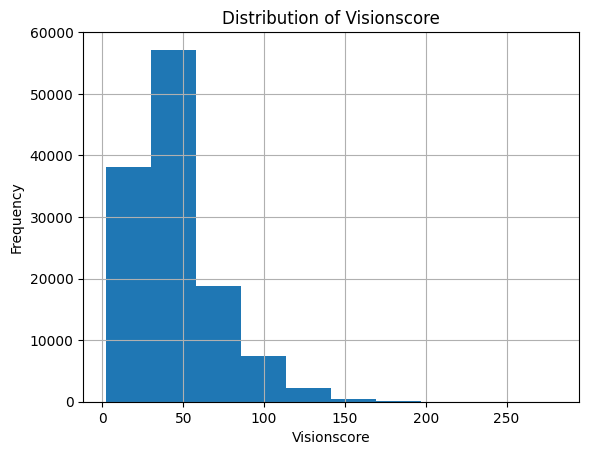
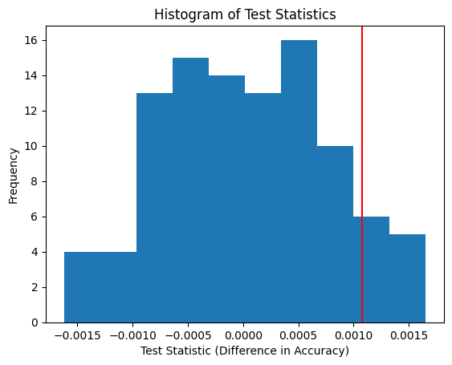

# League of League of Legends Role Prediction from Post-Game Data

## Framing the Problem

-   Clearly state your prediction problem and type (classification or regression). If you are building a classifier, make sure to state whether you are performing binary classification or multiclass classification.

This is a multiclass classification problem. The role/'position' being predicted has 5 possible values ('top', 'jng', 'mid', 'bot', 'sup').

-   Report the response variable (i.e. the variable you are predicting) and why you chose it, the metric you are using to evaluate your model and why you chose it over other suitable metrics (e.g. accuracy vs. F1-score).

For 'role', this information is stored in the 'position' column, so our response variable is naturally this column.

** Metric Discussion - Accuracy? **

The metric we have chosen to evaluate the model with is simply accuracy. For our case, false-negatives and false-positives have an equal cost (unlike in medical-diagonsis where false-negatives are potentially far more costly than false-positives). We want to maximize true-positives & true-negatives, and since we have an exactly even class distribution, we have chosen accuracy.

-   Note: Make sure to justify what information you would know at the “time of prediction” and to only train your model using those features. For instance, if we wanted to predict your final exam grade, we couldn’t use your Project 5 grade, because Project 5 is only due after the final exam!

Since we're dealing with post-game data (that's the nature of our dataset), our "time of prediction" would be when the game has already ended. Subsequently, other than the 'position' column (what we're trying to predict), we have access to all of the other columns at prediction time.

## Baseline Model

-   Describe your model and state the features in your model, including how many are quantitative, ordinal, and nominal, and how you performed any necessary encodings.

For our baseline model, we decided to keep it fairly bare-bones. The features we chose for it were, 'champion' (the name of the champion) and 'kill-death ratio' (an engineered feature for kills/deaths).

For 'champion' (nominal variable), most champions are usually designed for a specific role/position, so there is a ton of information that can be gained for using this column to predict position. We decided to one-hot encode this column, as it is a nominal data column.

The features of 'kills' and 'deaths' (both quantitative discrete variables) both potentially provide information into what role a player has. Roles such as supports, usually will have far less kills than more damage-oriented roles like a midlaner. Furthermore, since supports end up receiving less resources, they will end up being easier to kill than other members on their team. Thus, they would be expected to have a higher amount of deaths as well.

We chose to engineer a new feature 'kill-death ratio' (a quantitative continuous variable) because depending on how long a game goes on, kills and deaths could both increase dramatically. A high-kill hero, in a short game, could have less kills than a passive support in a long game. This fact could very well make it harder for a model to pick up on kill/death differences between roles. Accounting for this through a ratio, makes it so that we have a feature that is more consistent and resilient to the effects of game duration.

There were some issues with NaN/Inf from dividing by zero. We initially decided to deal with this through simple imputation with zero. However, this is not a good idea, since this would lead a hero with a kd of 10/0 to have an identical value for a hero with a kd of 0/10. To address this, we ended up adding one to every single death value.

[Note to Costin if reading this: We were just dumb and made silly bugs in code. Adding this feature does give model more information to improve training accuracy. :)]

-   Report the performance of your model and whether or not you believe your current model is “good” and why.

Usually random-forest classifiers handle large tabular data well, and perform decently in multiclass-classification problems. Through using a random-forest classifier with default sklearn hyper-parameters, we achieved these accuracies:

TRAIN: 0.9421552878179384  
VAL: 0.930843373493976

In this case, it doesn't seem as if there is too much overfitting going on, which is nice. (The training accuracy is not significantly higher than the validation accuracy.) Through this, our validation accuracy being only about a percent lower than our training accuracy, we'd argue that our baseline model performs well on unseen data.

-   Tip: Make sure to hit all of the points above: many projects in the past have lost points for not doing so.

## Final Model

-   State the features you added and why they are good for the data and prediction task. Note that you can’t simply state “these features improved my accuracy”, since you’d need to choose these features and fit a model before noticing that – instead, talk about why you believe these features improved your model’s performance from the perspective of the data generating process.

The features we ended up choosing to add were "visionscore", "earned gpm", "cspm", "vspm" , "earnedgold", "wardsplaced", "wpm".

For "visionscore" (quantitative discrete), "vspm" (quantitative continuous), "wardsplaced" (quantitative discrete), and "wpm" (quantitative continuous) these features are all related to supports. Support characters are usually responsible for placing 'wards', which grant 'vision' to their team, so subsequently, having higher values in these columns, makes it more likely that a player was in a support role during a match.

We decided to transform these features using a QuantileTransformer, as they were originally not distributed normally. See image below.

<!--  -->
<iframe src="images/visionscore_histogram.html" width="100%" height="500px" frameBorder=0></iframe>

The QuantileTransformer transforms features to follow a normal/uniform distribution (normal in our case), while preseving rank. While it does come at the cost of being a non-linear transformation (distorts linear correlations between variables), this entire process does end up reducing the impact of marginal outliers, making the model more robust.

For "earnedgold" (quantitative discrete), "earned gpm" (quantitative continuous), and "cspm" (quantitative continuous), having higher values for these features means one is more likely to be receiving a large chunk of resources on their team. Thus, it means that they're more likely to be in a carry role on their team. Having lower values for these columns, means that one is more likely to be a support.

For "earnedgold" and "earned gpm", these columns are fairly normal (insert plots), but are not standard normal.

<iframe src="images/earnedgold_histogram.html" width="100%" height="500px" frameBorder=0></iframe>

Some machine learning algorithms may behave poorly if features are not standard normally distributed. As a result, using a StandardScaler transformation to make these features standard-normal, would likely benefit performance (or not make a difference).

-   Describe the modeling algorithm you chose, the hyperparameters that ended up performing the best, and the method you used to select hyperparameters and your overall model. Describe how your Final Model’s performance is an improvement over your Baseline Model’s performance.

Similar to our baseline model, we decided to use a random forest classifier.

We used 5-fold cross validation to perform a gridsearch over these hyperparameters for our random forest classifier.

```
hyperparameters = {
    'random-forestn_estimators': [25, 50, 100, 150],
    'random-forestcriterion': ['gini', 'entropy'],
    'random-forestmax_depth' : [5, 10, 15, None],
    'random-forestmax_features': ['sqrt', 'log2']
}
```

Through our grid search, we found that this combination of hyperparameters led to the best results on cross-validation.

```
{
    'random-forestn_estimators': 150
    'random-forestcriterion': 'gini',
    'random-forestmax_depth': None,
    'random-forestmax_features': 'log2',
}
```

Through using these hyperparameters in our final model, the accuracy results were:

TRAIN: 1.000000000  
VAL: 0.9572690763052208

It's interesting to note how much higher our training accuracy is compared to our validation accuracy. This suggests that the model did notably overfit. However, our validation accuracy is still boasts a signifiant improvement over the validation accuracy for our baseline model (baseline model validation accuracy was: 0.930843373493976), which means that our final model generalized better to unseen data. There was roughly a 2.6% increase in accuracy for the validation set.

When running our model on our test set, which has not been used to fit parameters or hyperparameters, (untouched @ this point), our accuracy was:

TEST: 0.9568674698795181

It's entirely expected for our test accuracy to be lower than our validation accuracy. After all, our final model's hyperparameters were 'fit' to the validation set, making it 'seen' data in some sense. The test set used here is truly 'unseen' data.

## Fairness Analysis

-   Clearly state your choice of Group X and Group Y, your evaluation metric, your null and alternative hypotheses, your choice of test statistic and significance level, the resulting p
    -value, and your conclusion.

In League, there are two sides of the map. 'Red' and 'Blue'. We wanted to see whether model performance differs significantly between these two sides/groups.

Null Hypothesis: Our model is fair. It's accuracy for the Red & Blue sides are roughly the same, and any differences are due to random chance.  
Alt Hypothesis: Our model is unfair. It's accuracy for the Blue team is higher.

The test statistic we used was difference in accuracies. (blue_accuracy - red_accuracy). Higher values of the test-statistic point towards the Alternative Hypothesis, and lower values of the test statistic point towards the Null Hypothesis.

Our observed test statistic was: 0.0008353413654619279

We performed a permutation test and simulated 100 test statistics under the null. We found that at the 0.05 significance level, we fail to reject the null-hypothesis with a p-value of 0.13. We lack sufficient evidence to reject the null hypothesis that the two groups have roughly similar accuracies. This does not mean however, that the null-hypothesis is correct. It could very well be the case that the alternative hypothesis is correct, but we just don't have enough information to know for certain.

-   Optional: Embed a visualization related to your permutation test in your website.

<!--  -->
<iframe src="images/teststats_histogram.html" width="100%" height="500px" frameBorder=0></iframe>

-   Tip: When making writing your conclusions to the statistical tests in this project, never use language that implies an absolute conclusion; since we are performing statistical tests and not randomized controlled trials, we cannot prove that either hypothesis is 100% true or false.

“Only a Sith deals in absolutes” - Obi-Wan Kenobi
